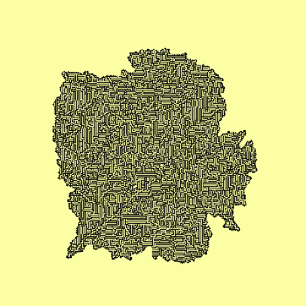

# Cellular Automata

  

A cell can be either alive or dead, and its next state depend on a set of rules applied on its neighbor cells. The number of possible sets are determined by the *recognized* neighbors of the cell. In this repository we present two modules for the elementary and life-like cases. The first is in $1\rm D$ and takes $2$ neighbors (left and right) into account, while the second is in $2\rm D$ and uses the Moore neighbourhood ($8$ individuals). **The methods developed make it possible for all possible sets of rules to be implemented because of binary encoding.**

## Elementary case

This is the $1\rm D$ case, the simplest. The image below shows the evolution of one of the possible $256$ sets of rules with different binary input arrays. The module `elementary.py` contains the class `ElementaryCA` from which any of the sets can be easily implemented. Examples can be found in `Examples/01-Elementary-CA.ipynb`.

  

## Life-like case

A cellular automaton is of this type is in $2\rm D$, its cells can have two states, and their next one depends on the Moore neighbourhood. Still very simple, but pretty results can be achieved with good matrix inputs (generally, not easy to find), and letting the system evolve. The module `lifelike.py` has the class `LifeLikeCA` that can be used to implement any of the $2^{18}-1$ sets of rules. Again, usage of it can be found in the folder `Examples`. 

The gif shown at the top of the description is the evolution of Conway's game of life; notice how the system ends up "destroying" itself with its own little spaceships! I also leave this little maze (result of rule $31752$), which is one of my favourites.

  

It's been fun! Hoping to take a look at Lenia later.
